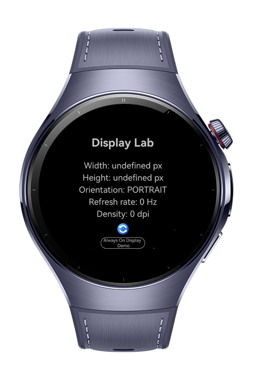
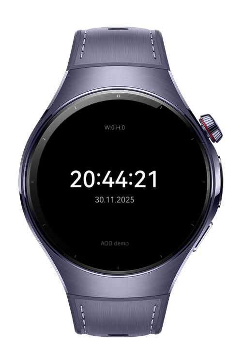

> **Note:** To access all shared projects, get information about environment setup, and view other guides, please visit [Explore-In-HMOS-Wearable Index](https://github.com/Explore-In-HMOS-Wearable/hmos-index).

# How To Use Display

This application is a simple codelab demo designed to test display capabilities on HarmonyOS-based Huawei wearable devices, including resolution, orientation, and refresh rate. It also features a minimal Pseudo Always-On Display (AOD) screen with a dark background and reduced brightness, simulating an AOD-style watch face at the application level. Developers can use this example to quickly explore display API usage, brightness control, and basic page navigation in HarmonyOS wearable apps.
# Preview

<div>
  
  
</div>

# Use Cases

Display API Testing
Validate and visualize screen characteristics (width, height, density, orientation).

Wearable UI Prototyping
Build and test simple UI layouts optimized for round or rectangular watch screens.

AOD Concept Demonstration
Simulate an Always-On Display interface for watches using low-brightness clock rendering.

Brightness Control Experiments
Adjust window brightness dynamically and observe per-window behavior on wearable devices.

# Technology

## Stack
- **Languages**: ArkTS, ArkUI
- **Frameworks**: HarmonyOS SDK 5.0.2(14)
- **Tools**: DevEco Studio Version 5.1.0.828
- **Libraries**:
    - `@kit.ArkUI`
    - `@kit.WindowKit`
    - `@ohos.display`

  
# Directory Structure

```
entry/
└── src/
└── main/
└── ets/
├── pages 
│   └── Always On Display.ets
│   └── Index.ets
```

# Constraints and Restrictions
## Supported Device

* Huawei Watch 5

# License

**How To Use Display** is distributed under the terms of the MIT License
See the [LICENSE](./LICENSE) for more information.